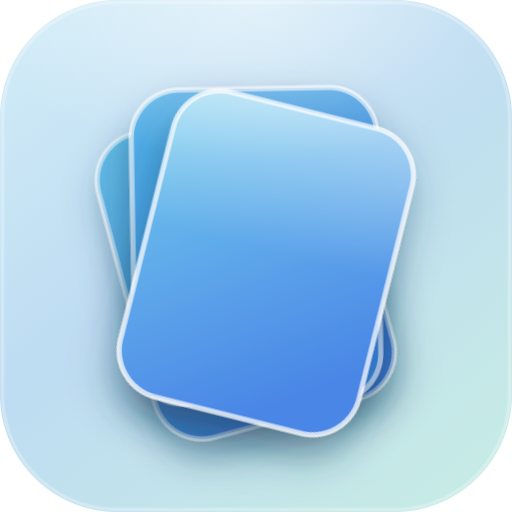
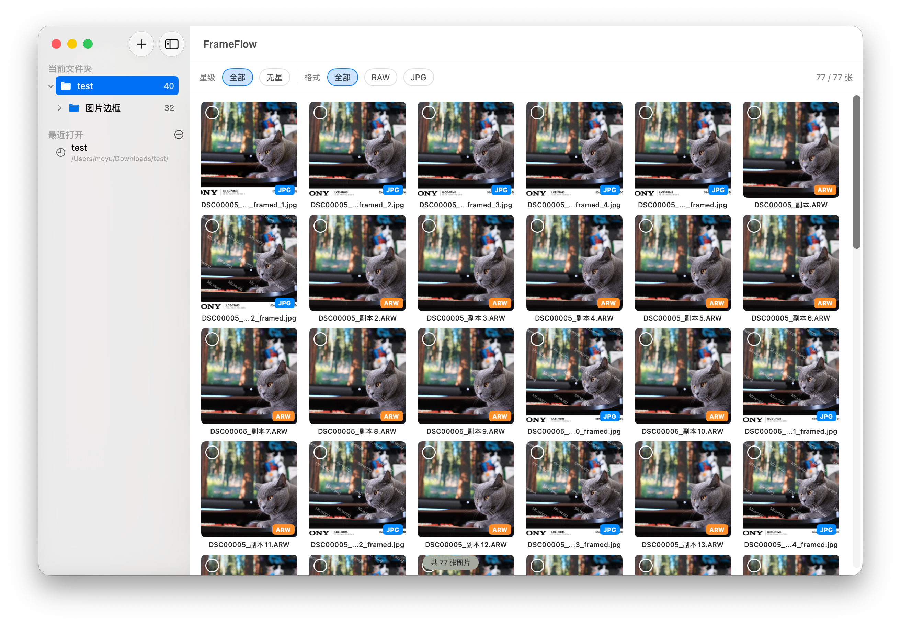
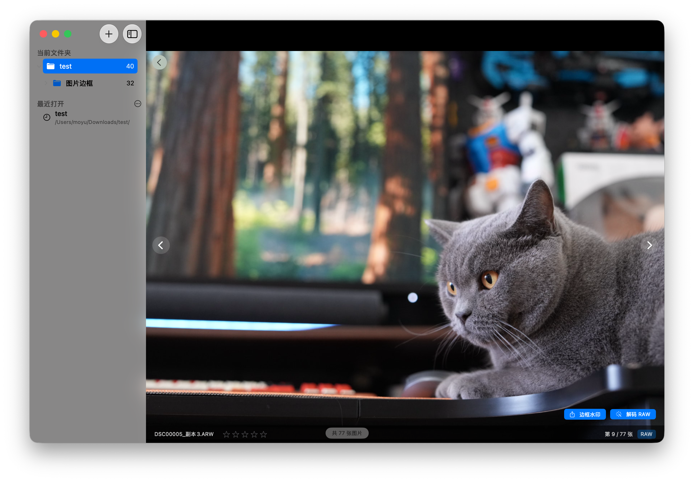
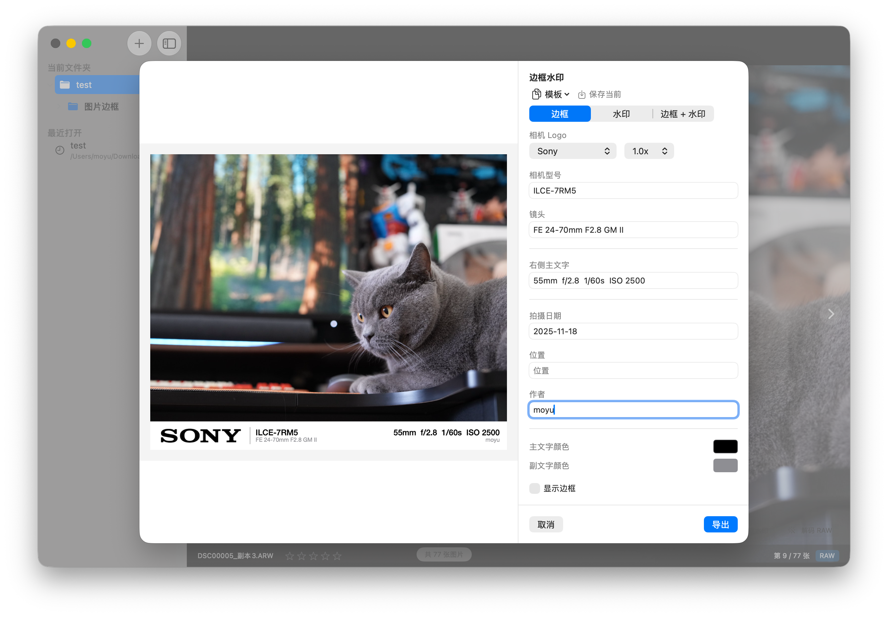
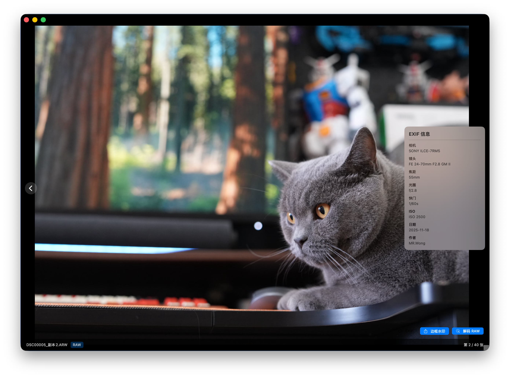

<p align="center">
  
</p>

<h1 align="center">FrameFlow</h1>

<p align="center">
  macOS 原生图片查看器，专为摄影师设计<br>
  <sub>Swift 6 · SwiftUI · macOS 26+</sub>
</p>

<p align="center">
  
  
  
</p>

---

## Screenshots

<!-- 请将截图放到 screenshots/ 目录，替换下方路径 -->

| 缩略图网格 | 图片查看 |
|:---:|:---:|
|  |  |

| 边框水印导出 | EXIF 信息 |
|:---:|:---:|
|  |  |

## Features

- **图片浏览** — 文件夹导入、缩略图网格、滚轮缩放、拖拽平移、键盘翻页
- **RAW 解码** — 原生 ImageIO 解码，支持 CR2 / CR3 / NEF / ARW / DNG / RAF / ORF 等
- **星级标记** — 1-5 星评级、按星级/格式筛选、一键归档
- **边框水印** — EXIF 信息栏、品牌 Logo、自定义水印、模板保存
- **独立看图** — 右键"打开方式"直接查看，支持 ESC 关闭
- **Finder 集成** — 注册为图片查看器，可设为默认打开方式

## Supported Formats

| 标准格式 | RAW 格式 |
|---------|---------|
| JPG / PNG / HEIC / HEIF / TIFF / BMP / GIF / WebP | CR2 / CR3 / NEF / ARW / DNG / RAF / ORF / RW2 / PEF / SRW / 3FR |

## Build

```bash
# 前置：macOS 26+, Xcode 27+, XcodeGen
brew install xcodegen

# 克隆 & 构建
git clone git@github.com:hong-zhijun/frame-flow.git
cd frame-flow
xcodegen generate
open FrameFlow.xcodeproj
```

### 打包发布

```bash
VERSION=1.0.2 BUILD=1 ./scripts/release.sh
# 输出: dist/FrameFlow-1.0.2-build1.dmg
```

## License

MIT
